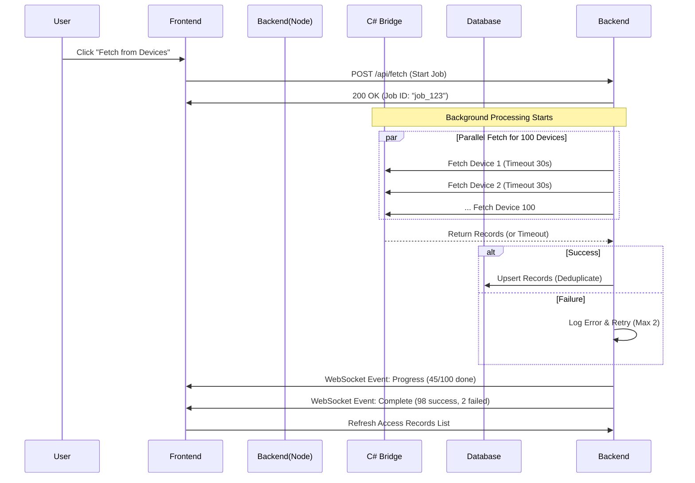

# Network Optimization Strategy for 100+ Remote Devices

## Overview
This document outlines the strategy for handling data fetching ("Fetch from Devices") across 100+ devices located in different networks with varying internet speeds, stability, and latency.

## The Challenge
When deploying 100+ devices across multiple locations, network conditions will vary significantly:
*   **Fast Connections**: Fiber optic (Latency < 20ms) → Fetch in ~2 seconds.
*   **Slow Connections**: 4G/DSL (Latency > 200ms) → Fetch in ~30-60 seconds.
*   **Unstable Connections**: High packet loss → Frequent timeouts or drops.
*   **Concurrent Load**: Fetching from all 100 devices simultaneously could overwhelm the C# Bridge or the database if not managed.

## Proposed Solution

### 1. Parallel Execution
Instead of fetching devices one by one (Sequential), we will launch fetch requests for all online devices simultaneously.
*   **Why**: Node.js handles I/O operations asynchronously. Waiting for Device 1 to finish before starting Device 2 wastes 99% of the time.
*   **Result**: Total fetch time equals the time of the *slowest* device (e.g., 45 seconds), not the sum of all devices (e.g., 75 minutes).

### 2. Strict Timeouts
Each device fetch operation must have a hard timeout limit (e.g., 30 seconds).
*   **Why**: A single device on a dead network shouldn't block the entire process.
*   **Behavior**: If a device doesn't respond within 30 seconds, mark it as "Failed/Timeout" and move on to the next device.

### 3. "Fire and Forget" (Background Processing)
The "Fetch from Devices" operation should run in the background, not blocking the main request-response cycle.
*   **Why**: Users shouldn't have to wait with a loading spinner for 60 seconds. They should be able to continue using the app (Live Events, Person Management) while fetching happens.
*   **Workflow**:
    1.  User clicks "Fetch".
    2.  Server responds immediately: "Fetch started."
    3.  Server processes in background.
    4.  Frontend polls for progress or receives WebSocket updates.

### 4. Partial Success Handling
The system must handle failures gracefully.
*   **Scenario**: 95 devices succeed, 5 devices fail (offline/timeout).
*   **Behavior**: Store records from the 95 successful devices immediately. Report the 5 failures in the result summary. Do not rollback successful data.

### 5. Retry Mechanism
For unstable connections, implement automatic retries.
*   **Strategy**: If a fetch fails due to network error, retry up to 2 times before marking as permanent failure.

## Implementation Workflow

## Key Metrics & Limits

| Metric | Value | Reason |
| :--- | :--- | :--- |
| **Max Concurrent Fetches** | 20 (Batching) | Prevents overwhelming the C# Bridge or DB connection pool. |
| **Timeout per Device** | 30 Seconds | Balances between waiting for slow devices and keeping system responsive. |
| **Max Retries** | 2 | Handles temporary network blips without excessive delay. |
| **Deduplication Method** | Database Unique Index | Fastest method; avoids loading millions of records into memory. |

## Benefits

1.  **User Experience**: Users get immediate feedback and can continue working.
2.  **System Stability**: Timeouts prevent the "Fetch" process from hanging indefinitely.
3.  **Scalability**: The system can handle 100, 500, or 1000 devices without performance degradation.
4.  **Data Integrity**: Partial success ensures data from healthy devices is never lost due to one bad connection.

## Next Steps
1.  Update `accessRecordFetchService.js` to support background processing.
2.  Implement WebSocket events for real-time progress updates.
3.  Add timeout configuration to the C# Bridge API calls.
4.  Update Frontend to show a progress bar instead of a simple loading spinner.

---

## Background Fetch with Progress Tracking

### 1. The Concept
This design pattern transforms a long-running "black box" operation into a transparent, user-friendly process. Instead of the user waiting for a single response, the system processes the task in the background and reports status updates in real-time.

#### The "Old Way" (Synchronous)
1.  **User Action:** Click "Fetch".
2.  **Frontend:** Displays a loading spinner.
3.  **Backend:** Fetches Device 1 → waits → Device 2 → waits... until Device 100.
4.  **Result:** The user is blocked for 60+ seconds. If the network is slow, the request might time out or the user might refresh the page, cancelling the task.

#### The "New Way" (Asynchronous)
1.  **User Action:** Click "Fetch".
2.  **Backend:** Immediately creates a **Job**, starts processing in the background, and returns a **Job ID**.
3.  **Frontend:** Displays a **Progress Panel** (e.g., "Fetching: 0%").
4.  **Processing:** The backend fetches devices in parallel batches.
5.  **Updates:** Via **WebSocket**, the backend pushes updates: *"Device 1 done... Device 50 done..."*.
6.  **Result:** The user can continue browsing, adding persons, or checking logs while the fetch completes.

### 2. Step-by-Step Workflow

1.  **Initiation:**
    *   User clicks "Fetch from Devices".
    *   Frontend sends: `POST /api/access-records/fetch-and-store`.
    *   Backend checks for active jobs. If none, starts a new one.
    *   Backend replies: `{"success": true, "jobId": "fetch_12345"}`.

2.  **Background Execution:**
    *   The `AccessRecordFetchService` iterates through the list of online devices.
    *   It processes devices in **batches** (e.g., 10 at a time) to balance speed and server load.

3.  **Progress Updates (The "Tracking"):**
    *   Progress is calculated as: `(Devices Completed / Total Devices) * 100`.
    *   **Example Updates:**
        *   `socket.emit('fetch:progress', { percent: 1, message: "Fetched ASI12" })`
        *   `socket.emit('fetch:progress', { percent: 50, message: "Fetched 50/100" })`

4.  **Completion:**
    *   Once all devices are processed, the backend emits:
    *   `socket.emit('fetch:complete', { totalRecords: 20000, errors: 0, summary: {...} })`.
    *   Frontend updates the UI to show "Success" and refreshes the data grid.

### 3. Technical Components

*   **Socket.io:** Used to push real-time events from the server to the frontend.
*   **Job State:** A simple in-memory object or state variable to track the current job status (`active`, `completed`, `failed`).
*   **Queueing:** If a user clicks "Fetch" multiple times, the system ignores subsequent clicks until the current job is finished to prevent network flooding.

### 4. Benefits

| Feature | Benefit |
| :--- | :--- |
| **Resilience** | Even if the user's internet flickers, the backend keeps fetching. The user just reconnects to see the result. |
| **User Experience** | The interface remains responsive. Users can perform other tasks (like "Add Person") while fetching runs. |
| **Visibility** | Users see exactly which devices succeeded and which failed (e.g., "Device ASI15: Timeout") rather than a generic error message. |
| **Scalability** | Decouples the API request lifecycle from the processing time, allowing the server to handle more concurrent users. |

---
**Created**: 2026-04-14
**Status**: Proposal for Network Optimization & Background Fetch
